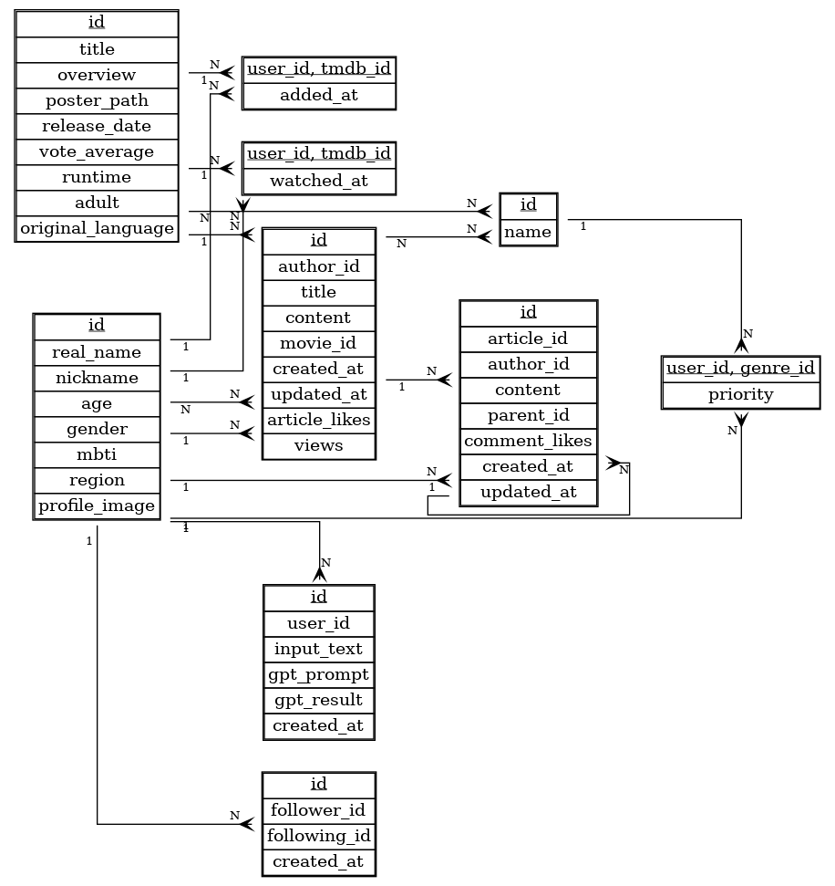

# MovieGPT 🎬🤖

> ## “내 기분·상황·취향까지 읽어 주는 **GPT 기반 영화 추천·리뷰 플랫폼**”

<p align="center">
  
  
  
  
  
  
</p>

### ✨ 프로젝트 철학
| 키워드 | 설명 |
|--------|------|
| **Personalized** | ➜ 선호 장르·MBTI·관심 태그·`WatchHistory` & `FavoriteMovie`를 사용해 개개인에 최적화된 추천 |
| **Explainable**  | ➜ GPT 프롬프트로부터 1문장 ‘🧠 추천 이유’ & 카드 오버레이로 **이해 가능한** 추천 제시 |
| **Social**       | ➜ 팔로우·팔로워, 댓글·좋아요, **Wordcloud**로 취향 공유 & 소셜 그래프 확장 |
| **Seamless UX**  | ➜ Pinia 캐시·드래그 스크롤·다크/라이트 모드·로딩 애니메이션 등 **끊김 없는 인터랙션** |

---

### 🏗️ 주요 기능

| 영역 | 기능 요약 |
|------|----------|
| **🎯 추천** | • GPT-3.5/4 선택    • 기분·상황·장르 태그 + 키워드 검색 <br/>• 이미 본 영화 제외 & 찜 영화 가중치 <br/>• TMDB enrich + 캐시 <br/>• Default (비회원 = 인기작 / 회원 = 선호 장르 가중) |
| **📄 Detail** | • 줄거리 ‘더보기…’ 토글 (<4줄 clamp) <br/>• Watch/Like 토글 → 추천 가중치 <br/>• OTT provider 뱃지 <br/>• 연관 영화 horizontal scroll |
| **👤 User** | • Django CustomUser(+MBTI) • 프로필/닉네임 수정 • 팔로우 토글 • 찜 목록 관리 |
| **📝 Review** | • 게시글 & 댓글 CRUD • Wordcloud (리뷰 텍스트 → Django Community 앱) |
| **🔗 Social** | • 팔로워/팔로잉 리스트 • 프로필 내 취향 분석(Wordcloud + 요약) |
| **💾 Persistence** | • Pinia `persist:true` → 로컬Storage 캐시 • `MovieStore.recommended` 10분 TTL |

---

### 🛠️ 기술 스택
| 분야 | 스택 |
|-------|-------|
| **Frontend** | Vue 3 (script setup) · Pinia · Vue-Router 4 · Axios · Bootstrap 5 (Dark/Light) |
| **Backend** | Django 4 · Django REST Framework · dj-rest-auth(Token) |
| **AI / Extra** | OpenAI Chat Completions · TMDB API · YouTube Data API (리뷰/쇼츠) |
| **Infra** | .env (Local)

## 🔧 프로젝트 개략 구조 및 ERD
```
│─ frontend/
│ ├─ src/
│ │ ├─ components/ # RecommendedPreview, Wordcloud, ...
│ │ ├─ pages/ # Home, Results, Detail, ...
│ │ ├─ stores/ # userStore, movieStore, reviewStore
│ │ └─ api/axios.js
│─ backend/
│ ├─ recommend/
│ │ ├─ views.py, prompt_builder.py, tmdb_client.py
│ │ └─ data/ popular_movies.json ...
│ ├─ accounts/
│ │ ├─ models.py, serializers.py, views.py
│ └─ core/, community/, ...
```



---


## 🚀 설치 & 실행

### 1) 환경변수
```
# .env 파일 생성
OPENAI_API_KEY=sk-xxxx
TMDB_API_KEY=xxxxxxxx
YOUTUBE_API_KEY=Axxxxx
```
- 상세 이용 방법은 각 API 설명 참조

### 2) 백엔드
```
cd Back_django
python -m venv venv
source venv/Script/activate
pip install -r requirements.txt
python manage.py migrate
python manage.py runserver
python loaddata genres
python loaddata converted_movie_fixture_final_unique
```
### 3) 프론트엔드
```
cd Front_vue
npm install
npm run dev
```

### 기본 URL

- Backend API : http://127.0.0.1:8000/
- Frontend Dev Server : http://localhost:5173/


### 📚 우리가 얻은 인사이트


| 카테고리                   | 배운 점 & 트러블 슈팅                                                                                                                                              |
| ---------------------- | ---------------------------------------------------------------------------------------------------------------------------------------------------------- |
| **Prompt Engineering** | `build_prompt()`에 *선호 장르 가중치*·*시청/찜 이력 반영* <br/>→ GPT가 중복·부적절 추천을 줄이고 개인화 ↑                                                                                |
| **API 비용 절감**          | Default 추천(비회원 인기작, 회원 장르풀) & Pinia TTL 캐싱(10 분)으로 GPT 토큰 사용량 ≈ 40 % 감소                                                                                    |
| **Dark / Light Theme** | Bootstrap 5 CSS 변수(`--bs-*`) 만으로 글자·배경·테두리 컬러를 자동 스위칭 → 별도 테마 코드 無                                                                                         |
| **UX 마찰 최소화**          | • router-link → `window.location.href` (Detail 내부 연관 영화)로 자연스러운 리다이렉트 <br/>• 줄거리 4줄 `line-clamp` + “더보기…” 토글 <br/>• 로딩 중 `@/assets/loading_1.mp4` 비디오 오버레이 |
| **DB Enrich 전략**       | GPT title ↔ 로컬 `Movie` 테이블 우선 조회 → 미존재 시 TMDB search & details fetch → DB upsert 후 응답 → 점진적 DB 형성                                                                      |


### 🛣️ 앞으로의 개선 로드맵

- 채팅형 추천(Conversational Re-Rank)

- “비슷한 톤으로 러닝타임 90분대만 보여줘” → 프론트 채널 유지 & 백엔드 Re-prompt

- Coldf-Start 보완

- 로그인 이전에도 간단한 설문 + 바로 추천, 미리 캐싱된 GPT 샘플 활용

- CI/CD & 배포 자동화

- GitHub Actions → Test → Lightsail Docker 배포
(Nginx Reverse-Proxy + Certbot HTTPS)

- 고객 행동 분석

- 찜/시청/검색 로그를 PostHog or Matomo로 수집 → 추천 로직 개선

### 🤝 팀 Collab

Git flow + Conventional Commits - PR 템플릿

### 🙌 Contributors

| 이름      | Role                       | GitHub                                           |
| ------- | -------------------------- | ------------------------------------------------ |
| **박준호** | Backend · DevOps           | [`@sunghajunho`](https://github.com/sunghajunho) |
| **김성하** | Frontend · Prompt Engineer | [`@kim`](https://github.com/kim)                 |


프로젝트에 대한 피드백·이슈는 언제든 환영합니다!
즐거운 영화 탐험 되세요. 🎥🍿